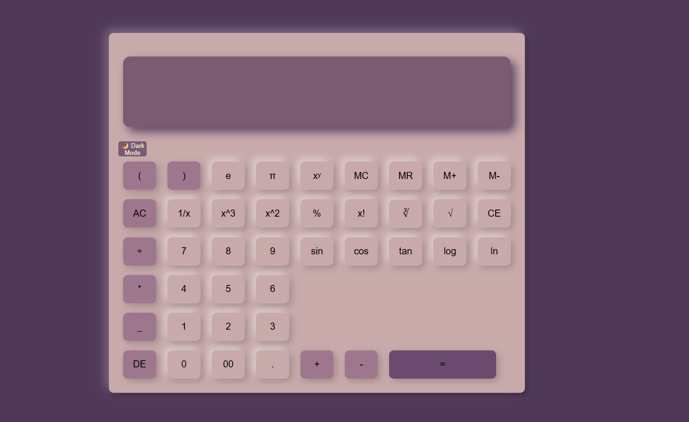

# SCientific Calculator 
A responsive **Scientific Calculator** built using **HTML, CSS, and JavaScript**. It performs basic arithmetic operations as well as advanced scientific calculations with an attractive Neumorphism UI. The calculator also supports **Dark Mode** and **Light Mode** for a better user experience.

## ✨ Features

 Basic arithmetic operations
  . Addition
  .Subtraction
  .Multiplication
  . Division

 Scientific functions
  .Square (x²)
  . Cube (x³)
  . Power (xʸ)
  . Square Root (√)
  . Cube Root (∛)
  . Factorial (x!)
  . Percentage (%)
  . Reciprocal (1/x)
  . Trigonometric Functions (sin, cos, tan)
  . Logarithm (log)
  . Natural Logarithm (ln)
  . Constants (π and e)

 Memory Functions
   MC (Memory Clear)
   MR (Memory Recall)
   M+ (Memory Add)
   M- (Memory Subtract)

-> 🌙 Dark Mode & ☀️ Light Mode Toggle
## 📸 Screenshots

### Dark Mode

### Light Mode

-> Responsive Design

## Technologies Used

. HTML5
. CSS3
.JavaScript

## Project Structure

Scientific-Calculator/
│── index.html
│── style.css
│── script.js
│── README.md
└── assets/

## Future Improvements

.Keyboard Support
. Calculation History
. Theme Customization
. Scientific Expression Parser
. Mobile App Version

## Author

Nandini Sharma
B.Tech CSE Student

GitHub: https://github.com/buildwith-nandini
